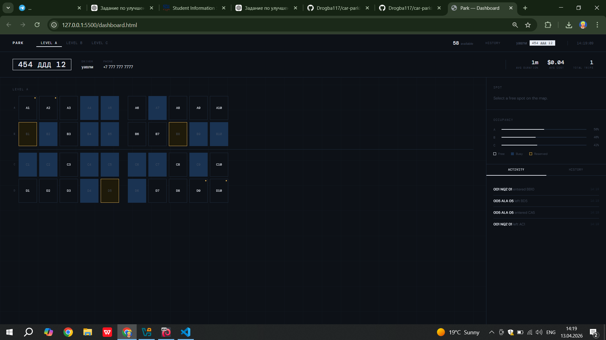

# Car Parking Management System

A simple web-based parking management system built using HTML, CSS, and JavaScript.


## Problem Statement

Managing parking manually can be inefficient and confusing. This project provides a simple interface to manage parking slots, track vehicles, and view parking history.


## Features

* Register vehicles into the parking system
* View parking dashboard
* Track parking history
* Simple and user-friendly interface


## Tech Stack

* HTML
* CSS
* JavaScript


## Project Structure

```
/project-root
 ├── src/
 │    ├── dashboard.html
 │    ├── dashboard.js
 │    ├── history.html
 │    ├── register.html
 │    ├── parking.js
 │    ├── style.css
 │
 ├── README.md
```


## Installation

1. Clone the repository:

```bash
git clone https://github.com/Drogba117/car-parking-management-system.git
```

2. Open the project folder:

```bash
cd car-parking-management-system
```

3. Open any HTML file (e.g. dashboard.html) in your browser


## Usage

* Open `register.html` to add a vehicle
* Open `dashboard.html` to view parking status
* Open `history.html` to see parking records


## Screenshots



## Improvements Needed

* Add backend (FASTAPI / database)
* Add authentication system
* Improve UI/UX
* Add validation and error handling


## Notes

This is a frontend-based academic project for learning purposes.


## Author

Gani Toremuratov

